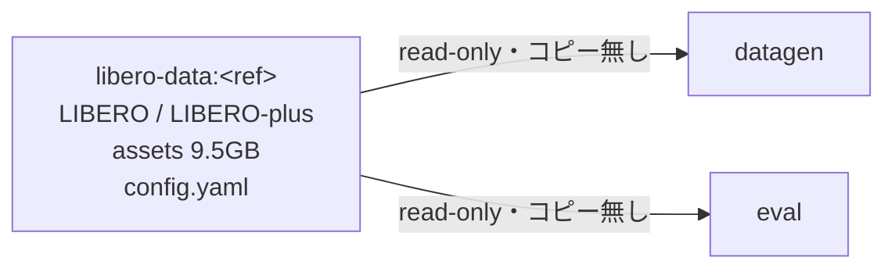

# lerobot_tools

LIBERO / LIBERO-plus などの LeRobot 形式のデータセットを使った**評価・学習・データ構築**を、行うためのツール群をまとめたリポジトリ。

大規模データは 1 つの Docker image に閉じ込め、どのコンテナからも読み込めるようにすることで、所要ハードディスク容量を節約している。

## 目次

- [1. 何が嬉しいのか](#1-何が嬉しいのか)
- [2. 使い始める](#2-使い始める)
- [3. 仕組み](#3-仕組み)

---

## 1. 何が嬉しいのか

LIBERO-plus の摂動用アセット (`assets.zip`) は**展開後 9.5GB** ある。用途ごとの image に毎回焼くと、その 9.5GB が image の数だけ増える。

> 摂動用アセット (`assets.zip`) : LIBERO-plus が「背景テクスチャ」「照明」などの条件を変えてモデルのロバスト性を測るために使う、通常の LIBERO には無い追加のテクスチャ・シーン定義一式

ここではこのアセットを `libero-data` という**データ専用 image** に 1 つだけ置き、各用途のコンテナはそれを read-only で読み込むだけとする。用途のコンテナは（同じ人が並行して複数のジョブを流す場合など）**同時に何本も起動されうる**が、その場合も `libero-data` の実体はコピーされず 1 つのまま共有される。用途の image が増えても、コンテナを何本立ち上げても、アセットの実体が増えることはないので、**ハードディスクの使用量増加幅を抑えられる**。

## 2. 使い始める

```bash
./datactl.sh doctor                       # 前提を確かめる
./datactl.sh build-data                   # データ image を構築（初回のみ・20 分ほど）
./datactl.sh build datagen                # データ作成 / 学習用 image を構築（初回のみ・10 分ほど）
./datactl.sh up datagen                   # コンテナに入る
```

`doctor` は以下を出力してくれる。うまくいかないときは、まずこれを打つ。

- docker のバージョン
- image マウントが使えるか
- データ image が構築できているか
- ハードディスクの空き

## 3. 仕組み

どのようにハードディスク容量を節約しているかを以下に示す。



image は `eval` / `datagen` / `train` の 3 つで、**どれも venv は 1 つだけ**である。そのため `python` を PATH に置いてあり、どれを呼ぶか迷う余地が無い。

どのデータ、情報をどこへ置くかの判断基準は以下の通り。
- **versions.env のバージョン値だけで中身が一意に決まり、どの用途の image からも読み込まれるだけのデータを共有の image（libero-data）に切り出す**
  - アセットや LIBERO/LIBERO-plus のソースはこれに当てはまる
- 一方、 venv やインストールするパッケージは用途（eval / datagen / train）ごとに中身が違うため、共有 image には置かない。

---

venv の分け方・ディレクトリ構成・バージョンの変え方・改修時の決まりごとといった、より詳しい
仕組みは [docs/architecture.md](docs/architecture.md) を参照。
